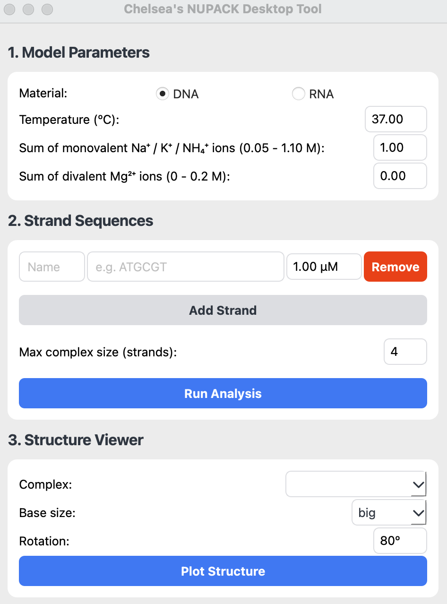
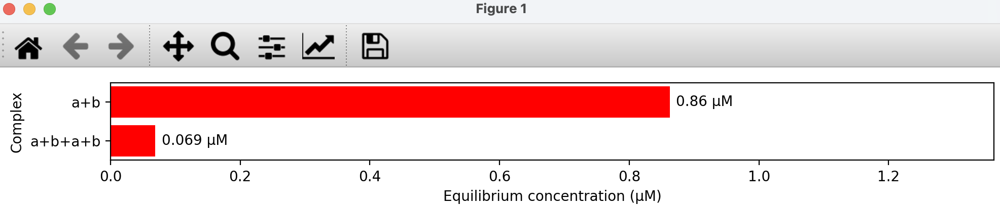
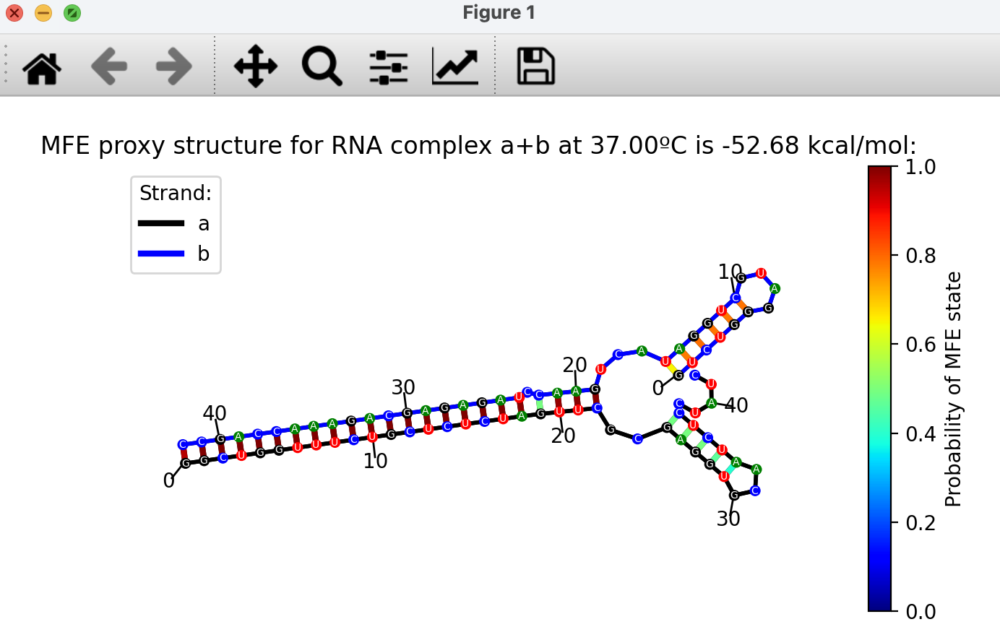

# DackPack - Nucleic Acid Analysis

DackPack is a..... It is implemented in Python.

## Features
- User-friendly interface for parameter and nucleic acid sequence input
- Automated calculation of equilibrium concentrations (via NUPACK1,2)
- Structure visualisation (using NucDraw3)

## In Developement
- Integration with Multistrand4,5 for kinetic simulations
- Latest NUPACK1,2 version integration for DNA/RNA hydrids, OMe RNA, and wider salt conditions

## Contact
Developed by Chelsea Dack, PhD student in the [Booth group](https://boothlab.uk/). E-mail: chelsea.dack.24@ucl.ac.uk

## Installation
1. First, make sure the following requirements are installed on your host system:
   - Python 3.10+a
   - [NUPACK 4.0.2+](https://www.nupack.org/download/overview) (see NUPACK installation instructions [here](https://docs.nupack.org/start/#installation-requirements))
2. If not already installed, also install the following packages:
    - `pip install pandas`
    - `pip install numpy`
    - `pip install matplotlib`
    - `pip install PySide6`
    - `pip install nucdraw`

## Use
To launch DackPack on MacOS:
   - Open a new Terminal window and type this line:
     - `python3 ./insert_path_to/DackPack.py`

To launch DackPack on Windows (using Ubuntu, assuming NUPACK installation as described [here](https://docs.nupack.org/start/#installation-requirements)):
   - Move the DackPack.py script into Ubuntu's Linux home directory
   - Open a new Ubuntu window and type this line:
     - `python3 DackPack.py`

To analyse nucleic acid sequences:
1. Input parameters and nucleic acid sequence(s)

2. Click 'Run Analysis' for calculation of equilibrium concentrations (via NUPACK1,2). This window will appear:

3. Click 'Plot Structure' for structure visualisation of a chosen complex (using NucDraw3). This window will appear, where individual bases / strand backbones are coloured by identity and base pairs are coloured by MFE probability:

## References:
1. M.E. Fornace, N.J. Porubsky, and N.A. Pierce (2020). A unified dynamic programming framework for the analysis of interacting nucleic acid strands: enhanced models, scalability, and speed. ACS Synth Biol, 9:2665-2678, 2020.
2. R. M. Dirks, J. S. Bois, J. M. Schaeffer, E. Winfree, and N. A. Pierce. Thermodynamic analysis of interacting nucleic acid strands. SIAM Rev, 49:65-88, 2007.
3. 10.5281/zenodo.15352138
4. Joseph M. Schaeffer (2013) Stochastic simulation of the kinetics of multiple interacting nucleic acid strands. Dissertation (Ph.D.), California Institute of Technology. [https://thesis.library.caltech.edu/7460/](https://thesis.library.caltech.edu/7460/)
5. Joseph M. Schaeffer, Chris Thachuk, Erik Winfree (2015) Stochastic simulation of the kinetics of multiple interacting nucleic acid strands. DNA Computing and Molecular Programming (DNA21), Lecture Notes in Computer Science (LNCS) volume 9211, pp 194-211. [https://doi.org/10.1007/978-3-319-21999-8_13](https://doi.org/10.1007/978-3-319-21999-8_13)
